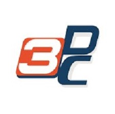

Hey, thanks for visiting my website. I'm Praveen Kumar G - a (2024) graduate from the [University of Minnesota - Carlson School Of Management](https://carlsonschool.umn.edu/graduate/masters/business-analytics). 
I'm an analytics consultant with almost two years of experience working in a pure play analytics firm [LatentView Analytics](https://www.latentview.com/) in their Consumer/CPG division.
   
# Education
-----

**Master of Science (MS) in Business Analytics, [University of Minnesota](https://carlsonschool.umn.edu/graduate/masters/business-analytics)**
#### June 2023 - Present | Minneapolis, USA

-----
I am currently pursuing my Graduate Degree in Business Analytics from the University of Minnesota.    
<strong>CGPA: </strong> 3.3/4.0  
<strong>Relevant coursework:</strong> Statistics, Advanced Databases, SQL  
 
-----

**Bachelor of Technology (B.Tech) in Electronics & Communication Engineering, [Vellore Institute Of Technology](https://mu.ac.in/)**
#### June 2016 - June 2020 | Chennai, India

-----
I completed my Undergraduate Degree in Electronics & Communication Engineering from the Vellore Institute Of Technology, Chennai, in 2020.    
<strong>CGPA:</strong> 3.49/4.0   
<strong>Relevant coursework:</strong> Embedded Systems, Analytics with IOT, Robotics, Python, SQL, MATLAB, Fundamentals of Programming  
 
# Experience
-----

**Senior Analyst, [LatentView Analytics](https://www.latentview.com/)** 
#### October 2022 - April 2023 | Chennai, India
----- 
*	Revamped the data processing pipeline for raw multispectral/RGB drone images to create the COCO dataset for the Convolutional Neural Networks in Linux
*	Spearheaded research on image processing techniques for boundary & object detection from stitched orthomosaic images by leveraging OpenCV in Python
*	Optimized operational processes of the Computer Vision & AI team by 60%+ and reduced 18+ man-hours per week
*	Conducted code reviews and collaborated with cross-functional stakeholders to revamp code review procedures
*	Designing & creating a relational PostgreSQL database to preserve JSON based drone data generated from the pilot portal

-----

**Analyst, [LatentView Analytics](https://www.latentview.com/)** 
#### October 2021 - October 2022 | Chennai, India
----- 
*	Revamped the data processing pipeline for raw multispectral/RGB drone images to create the COCO dataset for the Convolutional Neural Networks in Linux
*	Spearheaded research on image processing techniques for boundary & object detection from stitched orthomosaic images by leveraging OpenCV in Python
*	Optimized operational processes of the Computer Vision & AI team by 60%+ and reduced 18+ man-hours per week
*	Conducted code reviews and collaborated with cross-functional stakeholders to revamp code review procedures
*	Designing & creating a relational PostgreSQL database to preserve JSON based drone data generated from the pilot portal

-----

**Project Engineer, [WIPRO Technologies](https://www.wipro.com/)**
#### September 2020 - September 2021 | Bengaluru, India
-----
*	Refactored the consumer demographic data collection process and increased operational efficiencies by 12%
*	Collected & analyzed web scraped data in R to derive insights on customer behavior, informing strategies that increased the customer retention rate by 9%
*	Conceptualized and implemented A/B test plans to validate customer hypotheses and understand customer behavior patterns

-----

**Digital Analyst Intern, [Greymeter](https://aayush1909.github.io/)** 
#### December 2015 - January 2016 | Mumbai, India
-----
*	Re-engineered area-specific social media campaigns by analyzing student performance and collecting it in Excel
*	Used Marketing Analytics, Google Analytics to increase the likes on social media platforms by 58% in a month

-----

**Marketing Research Analyst Intern, [3DcreatR](http://www.3dcreatr.com/)** 
#### July 2015 - August 2015 | Mumbai, India
-----
*	Researched the various pedagogical trends to understand the willingness of schools to add 3D printing to their curriculum 
*	Re-designed the database of the top schools willing to participate in this program and improved the data quality by 17%

 

# Key Skills
----
* <strong> Programming Languages: </strong> Python, R, Java, HTML5, CSS3, C, Javascript  
* <strong> Operating Systems: </strong> Windows, Linux, Ubuntu  
* <strong> Libraries: </strong> PyTorch, Tensorflow, Keras, Numpy, Pandas, Matplotlib, Seaborn, Scikit-learn, Statsmodel, NLTK, Caret, Ggplot  
* <strong> Databases: </strong> MySQL, PostreSQL, T-SQL, MongoDB, SSMS, SSIS  
* <strong> Visualization Tools: </strong> Tableau, PowerBI, Qlikview  
* <strong> Modeling: </strong> Linear Regression, Logistic Regression, SVM, Decision Trees, Random Forests, Bagging, Boosting, K-means, KNN, Latent Dirichlet Allocation, Sentiment Analysis, Lasso Regression, Ridge Regression, Naïve Bayes, Deep Neural Networks, Convolutional Neural Networks, ARIMA, SARIMA  
* <strong> Tools: </strong> AWS SageMaker, AWS Lambda, AWS EC2, AWS API Gateway, Jira, Git, MS Excel  
  
----
