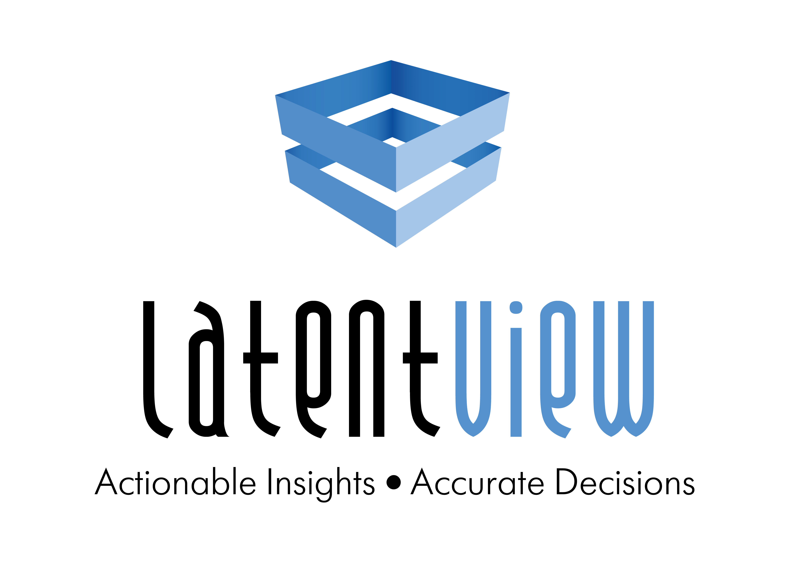

Hey, thanks for visiting my website. I'm Praveen Kumar G - a (2024) graduate from the [University of Minnesota - Carlson School Of Management](https://carlsonschool.umn.edu/graduate/masters/business-analytics). 
I'm an analytics consultant with almost two years of experience working in a pure play analytics firm [LatentView Analytics](https://www.latentview.com/) in their Consumer/CPG division.
   

# Objective
Experienced data science and analytics consultant specializing in CPG industry, delivering end-to-end projects for valuable
insights. Seeking new opportunities in analytics consultancy to drive growth and deliver impactful solutions.
   

# Education
-----

**Master of Science (MS) in Business Analytics, [University of Minnesota](https://carlsonschool.umn.edu/graduate/masters/business-analytics)**
#### June 2023 - Present | Minneapolis, USA

-----
I am currently pursuing my Graduate Degree in Business Analytics from the University of Minnesota - Carlson School Of Management.    
<strong>CGPA: </strong> 3.3/4.0  
<strong>Relevant coursework:</strong> Statistics, Advanced Databases, SQL  

-----

**Bachelor of Technology (B.Tech) in Electronics & Communication Engineering, [Vellore Institute Of Technology](https://mu.ac.in/)**
#### June 2016 - June 2020 | Chennai, India

-----
I completed my Undergraduate Degree in Electronics & Communication Engineering from the Vellore Institute Of Technology, Chennai, in 2020.    
<strong>CGPA:</strong> 3.49/4.0   
<strong>Relevant coursework:</strong> Embedded Systems, Analytics with IOT, Robotics, Python, SQL, MATLAB, Fundamentals of Programming  
 
# Experience
-----

**Senior Analyst, CPG, [LatentView Analytics](https://www.latentview.com/)** 
#### October 2022 - April 2023 | Chennai, India
----- 
*	Led a team of five analysts, delivering high-quality solutions and ensuring timely delivery of market insights and analysis. Pioneered problem-solving ideation and led the implementation of RFP solutions.
*	Identified growth opportunities and engaged in strategic conversations with CPG executives, building a comprehensive problem universe and offering solutions.
*	Contributed to developing inbound analytical capabilities, expanding LatentView's offerings in CPG thereby strengthening partnerships.
*	Honored with Rising Star Award for exemplary contributions to the company's success. One of only five employees from analysts to managers in LatentView to receive the award, as chosen by an esteemed leadership panel.

-----

**Analyst, CPG, [LatentView Analytics](https://www.latentview.com/)** 
#### October 2021 - October 2022 | Chennai, India
----- 
*	Revamped the data processing pipeline for raw multispectral/RGB drone images to create the COCO dataset for the Convolutional Neural Networks in Linux
*	Spearheaded research on image processing techniques for boundary & object detection from stitched orthomosaic images by leveraging OpenCV in Python
*	Optimized operational processes of the Computer Vision & AI team by 60%+ and reduced 18+ man-hours per week
*	Conducted code reviews and collaborated with cross-functional stakeholders to revamp code review procedures
*	Designing & creating a relational PostgreSQL database to preserve JSON based drone data generated from the pilot portal

-----

**Project Engineer, Research & Development - Automotive [WIPRO Technologies](https://www.wipro.com/)**
#### September 2020 - September 2021 | Bengaluru, India
-----
*	Refactored the consumer demographic data collection process and increased operational efficiencies by 12%
*	Collected & analyzed web scraped data in R to derive insights on customer behavior, informing strategies that increased the customer retention rate by 9%
*	Conceptualized and implemented A/B test plans to validate customer hypotheses and understand customer behavior patterns

-----
 

# Key Skills
----
* <strong> Programming Languages: </strong> Python, R, MATLAB, MySQL  
* <strong> Libraries: </strong> PyTorch, Tensorflow, Keras, Numpy, Pandas, Matplotlib, Seaborn, Scikit-learn, Statsmodel, NLTK, PyCaret, Ggplot  
* <strong> Visualization Tools: </strong> Tableau, PowerBI  
* <strong> Modeling: </strong> Linear Regression, Logistic Regression, SVM, Decision Trees, Random Forests, Bagging, Boosting, K-means, KNN, Latent Dirichlet Allocation, Sentiment Analysis, Lasso Regression, Ridge Regression, Naïve Bayes, Deep Neural Networks, Convolutional Neural Networks, ARIMA, SARIMA  
* <strong> Tools: </strong> Jira, Git, MS Excel, Azure, PySpark, PowerPoint  
  
----
