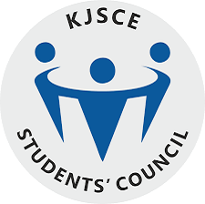
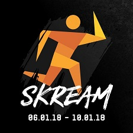
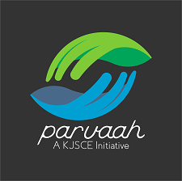

-----

**Sports Secretary, KJSCE Students' Council**
#### June 2017 - June 2018 | Mumbai, India

-----
* Was responsible for all the sporting activities of the college and helped budding sportsmen prove their talent in state and national level competitions
* Galvanized all the sports teams of the college to participate in competitions across the country
* Established an intra-departmental competition to increase participation from students across the college
* Introduced Kabaddi and Kho-Kho which proved to be successful sports for the college  

-----

**Team Lead, KJSCE Skream**
#### September 2017 - January 2018 | Mumbai, India

-----
* Led a team of over 200 students at a national level sports festival – Skream ‘18
* Acted as a liaison between administrative staff and the organizing committee
* Used Google Analytics and Facebook Insights to understand the needs of sponsors and participants
* Saw an increase in the sponsor count from 50 to 75 and the number of particpants from 2500 to 4000 from the previous year
* We managed to raise our profits by almost 15%  

-----

**Convener, KJSCE Parvaah**
#### June 2016 - June 2019 | Mumbai, India

-----
* Championed for the rights of the LGBTQ+ community in Mumbai through pride walks, cycle rallies and workshops
* Spread awareness about health and sanitation by attending regular beach cleanups and by beautifying a railway station in Mumbai, India  

-----

**Organizing Committee, KJSCE Abhiyantriki**
#### June 2017 - Septmeber 2017 | Mumbai, India

-----
* Hosted exhibits from Indian Space Research Organization (ISRO), Defence Research and Development Organization (DRDO) and Department of Atomic Energy (DAE) at the technical symposium of our college
* Led the team of internship expo which saw a 200% increase in the number of companies hiring from the previous year  

-----
