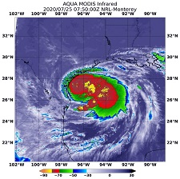
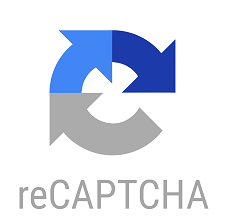

-----

**Data Scientist, ML-Driven DNS Malware Detection System**
#### March 2020 - June 2020 | Seattle, USA

-----
*	Developed and deployed RESTful APIs using AWS API Gateway to predict fully qualified domain names as DGA or Benign
*	Implemented an XGBoost Classifier using AWS SageMaker on a custom 15 million dataset uploaded to an S3 bucket
*	Scaled the product to 1,000,000+ predictions per minute through AWS Lambda  

Here is the - [Github Repo](https://github.com/aayush1909/DGA-or-Benign)

-----

**Team Lead, Grocery Retail Sales Analysis**
#### May 2020 | Seattle, USA

-----
*	Analyzed various store trends and created dashboards using Tableau to understand categories and items the store can focus on
*	Predicted total revenue of a grocery store for the forthcoming months by applying FBProphet model on accrued time-series data
*	Achieved the 2nd position for the Best Machine Learning Model at the Premier University of Washington Hackathon

Here is the - [Github Repo](https://github.com/aayush1909/Grocery-Retail-Sales-Analysis)

-----

**Business Intelligence Engineer, Sales Data Warehousing and Visualization**
#### March 2020 - June 2020 | Seattle, USA

-----
*	Created ETL operations to stage and pipeline 250,000 transactions of sales data into a data warehouse using SQL Server
*	Discovered key data-driven insights to enhance product sales and profits using Tableau visualizations and Dashboards  

Here is the - [Github Repo](https://github.com/aayush1909/Business-Intelligence-Systems)

-----

**Data Scientist, Fresh or Rotten?**
#### February 2020 - March 2020 | Seattle, USA

-----
*	Mined reviews to classify them as fresh or rotten on the Rotten Tomatoes Movie Review data using Naïve Bayes algorithm
*	Tuned the model’s hyperparameters using K-Fold Cross Validation and used TF-IDF to attain an accuracy of 67.03%  

Here is the - [Github Repo](https://github.com/aayush1909/Fresh-or-Rotten)

-----

**Business Intelligence Engineer, University of Washington Database Management**
#### February 2020 - March 2020 | Seattle, USA

-----
*	Created a data warehouse to virtualize the student resources throughout campus in MySQL and SQL Server
*	Examined the collections using statistical analysis and presented findings using Power BI  

-----

**Data Analyst, FIFA '20 Analysis**
#### January 2020 | Seattle, USA

-----
*	Analyzed the data to see the 20 most competitive clubs in the world and the best suited ones for young players to grow
*	Applied Recursive Feature Elimination, Lasso and Ridge Regression to see the potential of players with an accuracy of 84%
*	Secured the 2nd runners-up position at the Datathon held at the University of Washington  

Here is the - [Github Repo](https://github.com/aayush1909/Fifa_Analysis)

-----

**Data Analyst, AccuWater**
#### October 2019 | Seattle, USA

-----
*	Built a prototype in 36 hours to determine the most prominent features causing algal growth in oceans using NASA’s MODIS data 
*	Applied feature engineering and Random Forest to predict the algal growth with an accuracy of 90% based on 11 features  

Here is the - [Github Repo](https://github.com/aayush1909/AccuWater)

-----

**Software Developer, Stock Market Forecasting**
#### August 2018 - May 2019 | Mumbai, India

-----
*	Designed a real-time investment portal on the Bombay Stock Exchange (BSE) data using Python
*	Implemented a hybrid model of Neural Networks, Support Vector Regression and Sentiment Analysis with an accuracy of 95%  

Here is the - [Github Repo](https://github.com/aayush1909/Stock-Market-Forecasting)

-----

**Machine Learning Engineer, Breaking CAPTCHA using CNN**
#### October 2017 - November 2017 | Mumbai, India

-----
*	Tested the robustness of a CAPTCHA generator using CAPTCHA’s drawn in a convoluted way
*	Implemented CNN for alphabet/digit recognition which was able to break the CAPTCHA generator exposing security risks  

Here is the - [Github Repo](https://github.com/aayush1909/Breaking-Captcha-Using-Machine-Learning)

-----

**Data Scientist, App Rating Prediction**
#### January 2019 | Mumbai, India

-----
* Developed a Google Apps rating predictor using machine learning algorithms with the best performing error rate of 0.13
* Evaluated the performance using Root Mean Squared Error, R-squared error, Residual Standard Error and Mean Absolute Error  

Here is the - [Github Repo](https://github.com/aayush1909/App-Rating-Prediction)

-----

**Machine Learning Engineer, Extracting Main Topic from a Document**
#### March 2019 | Mumbai, India

-----
* Preprocessed the raw document using tokenization, lemmatization and stemming
* Implemented Latent Dirichlet Allocation (Natural Language Processing) to extract the main topics from the document  

Here is the - [Github Repo](https://github.com/aayush1909/Extracting-main-topics-using-LDA)

-----

**Web Developer, Hospital Management System**
#### July 2017 to November 2017 | Mumbai, India

-----
* Developed a website with basic functionalities such as booking an appointment, finding the right doctor, etc using HTML, CSS, PHP, JavaScript and Session Handling  

Here is the - [Github Repo](https://github.com/aayush1909/Hospital-Management-Website)

-----
